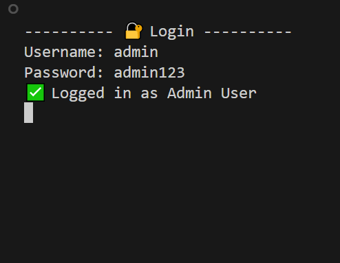
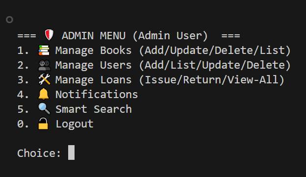
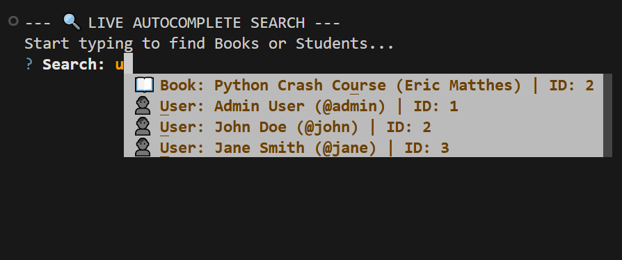
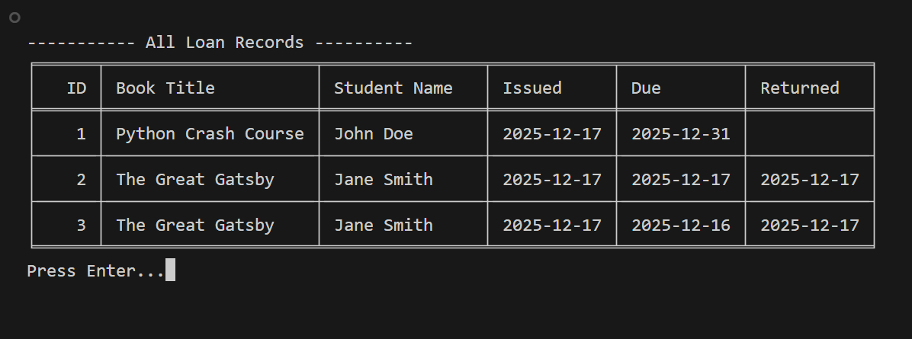

# LibTrack 📚

**LibTrack** is a robust, Command-Line Interface (CLI) Library Management System built with Python and SQLite3. It simulates real-world library operations, featuring inventory tracking, automated fines, role-based access control, and an interactive notification center.

## 🎥 Demo Video
Watch the full system walkthrough:

[](https://youtu.be/qAYon8zTIWE)

## 🖼️ Screenshots

| Login Screen | Admin Dashboard |
|:---:|:---:|
|  |  |
| *Secure Login System* | *Notification Center & Stats* |

| Smart Search | Reports |
|:---:|:---:|
|  |  |
| *Autocomplete functionality* | *Detailed Loan Records* |

## 🚀 Key Features

### 🛡️ Administrator Features

* **User Management**: Create, update, and delete users. Includes **Safety Guardrails** to prevent deleting the last Admin or users with active loans.

* **Inventory Control**: Full CRUD (Create, Read, Update, Delete) operations for books. Tracks total vs. available copies.

* **Smart Search**:  An autocomplete-powered search bar (using `questionary`) to instantly find Books or Users by typing.

* **Loan Management**: Issue and return books. Automatically decrements stock upon issuance.

* **Notification Center**: Automatic daily alerts for overdue books or books due today. 

* **Fine Calculation**:  Automatically calculates fines ($1.00/day) for late returns.

### 🎓 Student Features

* **Catalog View**:  Browse available books in the library. 

* **Search**: Find books by Title or Author using the smart search interface. 

* **My Dashboard**: View personal borrowing history, active loans, due dates, and return status.

* **Self-Service**: Update personal credentials securely.

## 🛡️ Safety & Guardrails

This system includes logic to prevent data corruption and accidental lockouts: 

* **Anti-Lockout**:  You cannot demote or delete the last Administrator.

* **Active Loan Protection**: You cannot delete a user or a book if there is an active loan associated with them.

* **Stock Logic**: Prevents issuing books that are out of stock (0 available).

* **Input Validation**:  All inputs are sanitized to prevent empty strings or invalid formats.

## 🛠️ Prerequisites

* **Python 3.8+**

* **External Libraries**: 

  ```bash
  tabulate      # For pretty printing tables
  questionary   # For interactive menus and autocomplete
  ```

## ⚡ Quick Start & Installation

Follow these steps to get the system running on your local machine. 

### 1. Clone the Repository

```bash
git clone https://github.com/im-amal-raj/LibTrack.git
cd LibTrack
```

### 2. Install Dependencies

```bash
pip install tabulate questionary
```

### 3. Initialize the System

**Step A: Create the Super-User (Admin)**

By default, the *Register* option in the main menu only creates "Student" accounts. To create your first **Admin** account, you must run the bootstrap script:

```bash
python setup_admin.py
```

**Step B: Seed Sample Data (Optional)**

Want to test the system immediately with dummy data? Run this script to populate the database with 15+ classic books. 

```bash
python seed_books.py
```

### 4. Run the Application

Launch the main system:

```bash
python main.py
```

## 📂 Project Structure

| File | Description |
| --- | --- |
| `main.py` | **Entry Point**: Handles the main loop and switches between Guest, Admin, and Student views. |
| `models.py` | **Logic**: Contains the `LibraryManager` class. Handles all Database interactions (SQL) and business logic. |
| `views.py` | **UI**: Handles specific UI sub-menus (Book Menu, User Menu) and the Smart Search logic. |
| `utils.py` | **Helpers**: Functions for input validation, date math, and screen clearing. |
| `setup_admin.py` | **Bootstrap**: A standalone script to inject the initial Admin user into the database. |
| `seed_books.py` | **Data**: A script to populate the database with initial book data for testing. |
| `test.db` | **Database**: SQLite database file (Created automatically on first run). |

## 🤝 Contributing

Contributions are welcome! Please fork the repository and submit a pull request for any enhancements or bug fixes.

1. Fork the Project
2. Create your Feature Branch (`git checkout -b feature/AmazingFeature`)
3. Commit your Changes (`git commit -m 'Add some AmazingFeature'`)
4. Push to the Branch (`git push origin feature/AmazingFeature`)
5. Open a Pull Request

## 📄 License

Distributed under the MIT License. See `LICENSE` for more information.
